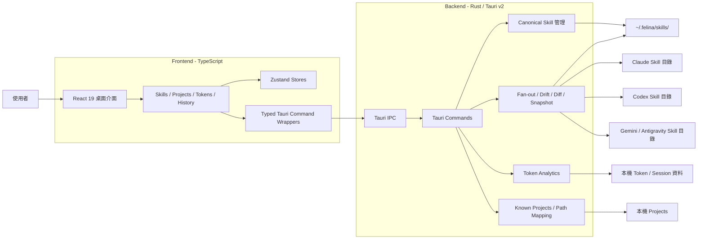
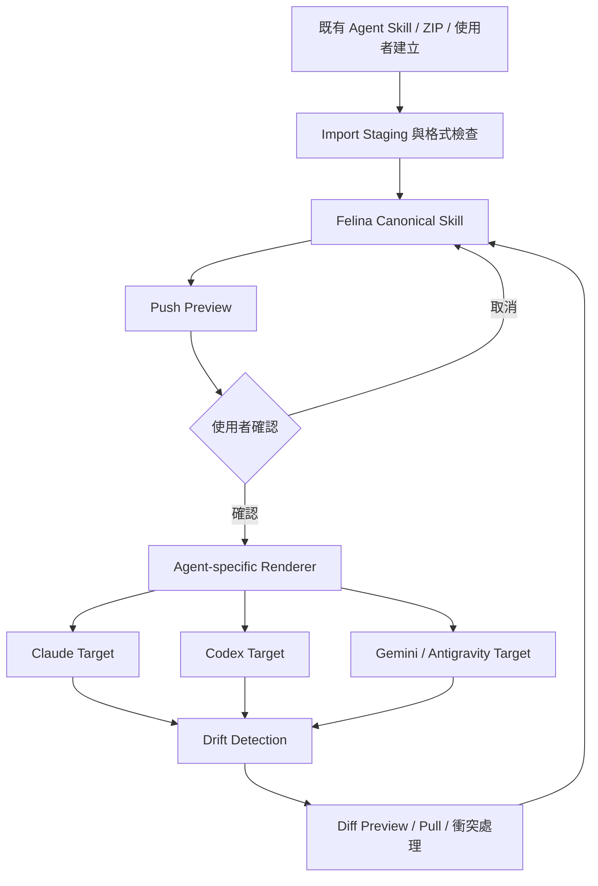

# Felina 桌面應用程式開發報告

> 競賽報告與後續簡報製作基礎文件
> 資料盤點日期：2026-06-04
> 事實依據：Git history、`openspec/changes/archive/`、`.session/product-backlog.md`、現行專案架構文件

---

## 一、專案摘要

Felina 是一套在使用者電腦本機運作的 AI Agent 管理桌面應用程式，主要服務同時使用 Claude Code、OpenAI Codex CLI、Gemini / Antigravity CLI 的開發者與團隊。

不同 Agent 對 Skill 的儲存路徑、檔案格式與專案範圍各有差異。當使用者需要在多個 Agent 與專案之間共用同一套 Skill 時，容易產生重複維護、版本分歧、誤覆蓋與同步狀態不透明等問題。

Felina 以「Canonical Source + Fan-out」為核心：使用者只需維護一份 Felina canonical Skill 主檔，再由系統轉換並同步到各 Agent 的原生目錄。同時，Felina 提供差異預覽、偏移偵測、本機版本快照、匯入審核與 Token Analytics，讓多 Agent 工作流程可以被集中管理、追蹤與驗證。

Felina 採 local-only 設計，Skill、設定與使用紀錄皆保留於本機，不依賴伺服器、遙測、遠端同步或雲端儲存。

### 已驗證的開發成果

| 項目 | 截至 2026-06-04 的可驗證數據 |
|---|---:|
| Git 開發紀錄涵蓋期間 | 2026-05-19 至 2026-06-03 |
| Git commits | 229 |
| 非 merge commits | 148 |
| 已封存 Spectra changes | 67 |
| 現行正式 specs | 35 |
| Backlog planned changes | 2 |
| Backlog suggestions | 10 |
| Git contributors | 2 |

以上數據代表開發活動與規格產出，不直接等同於使用者效益；實際效益將透過本報告提出的 KPI 驗證。

---

## 二、問題陳述與解決方案

### 2.1 應用場景

Felina 聚焦下列實際使用情境：

1. 開發者同時使用多套 Agent CLI，希望共用相同的專案規範、工作流程與 Skill。
2. 團隊在多個專案中配置 Agent Skills，需要知道哪些 Skill 已部署、部署到哪個 Agent，以及目前是否同步。
3. 使用者從外部工具或既有 Agent 目錄修改 Skill 後，需要避免下一次同步時靜默覆蓋內容。
4. 使用者希望檢視多 Agent 的 Token 與 Session 使用紀錄，但不希望將資料上傳至遠端服務。

### 2.2 核心痛點與對應方案

| 痛點 | 造成的影響 | Felina 解決方案 | 目前狀態 |
|---|---|---|---|
| 同一份 Skill 散落於不同 Agent 與專案目錄 | 重複維護、內容不一致、難以追蹤來源 | 以 `~/.felina/skills/` 作為 canonical source，再 fan-out 至 Agent 原生目錄 | 已完成 |
| 各 Agent 的 Skill 格式與欄位不同 | 手動轉換容易出錯，難以直接共用 | 依 Agent 執行格式轉換，並支援 Agent-specific fields | 已完成 |
| 外部修改可能被下一次 Push 覆蓋 | 使用者無法確認哪一份內容才是最新版本 | Drift Detection、Push/Pull 前差異預覽、衝突阻擋 | 已完成 |
| 匯入流程可能靜默覆蓋 canonical Skill | 既有內容或同步 metadata 可能受損 | 匯入先進入 staging，經比對與使用者確認後才寫入 | 已完成 |
| 多專案部署狀態不透明 | 難以確認 Skill 覆蓋範圍與同步狀態 | Projects 視角、Coverage Matrix、Target 狀態與同步資訊 | 已完成 |
| Token 與 Session 資料分散於不同 Agent | 缺乏跨 Agent 的本機使用洞察 | Token Analytics Dashboard 與 History | 已完成 |
| Push 路徑可能執行不必要工作 | 多 Skill 同步時可能增加等待時間 | NoOp fast-path 與跨 Skill 並行化 | Backlog planned change，尚未實作 |

### 2.3 解決方案的實用性

Felina 並非要求 Agent 採用新的封閉格式，而是保留各 Agent 的原生目錄與格式。這使使用者仍可使用既有 CLI 與編輯器，同時透過 Felina 取得集中管理、可視化同步與衝突保護。

核心操作流程如下：

```text
建立或匯入 Skill
      ↓
在 Felina canonical store 集中編輯
      ↓
選擇 Agent / Project targets
      ↓
預覽同步操作與差異
      ↓
確認後 fan-out 至 Agent 原生目錄
      ↓
持續檢查 drift、coverage 與同步狀態
```

---

## 三、核心功能

### 3.1 Multi-Agent Skill 中央管理

- 以 canonical Skill 主檔作為單一維護來源。
- 支援 Claude、Codex、Gemini / Antigravity 的 Agent-native Skill 目錄。
- 管理 Global / Project targets、啟用狀態與同步模式。
- 提供 Skill 建立、編輯、重新命名、刪除、匯入與匯出。
- 提供 Markdown 預覽、Split View 與來源對照。

### 3.2 可驗證的同步與衝突防護

- Push 前預覽實際變更與受影響 targets。
- 偵測 Agent-side drift，顯示不同步狀態。
- Pull 前提供行級 diff preview。
- 以本機 Git snapshot 保存同步基準，支援後續差異比較。
- ZIP 匯入先解壓至暫存區並進入 staging，避免直接寫入 canonical store。
- 同步狀態透過 Coverage Matrix、Target Chips 與 Sync Preview 呈現。

### 3.3 Projects 管理視角

- 彙整 Known Projects。
- 從 Project 視角檢視 Agent-native Skills 與 Felina 納管狀態。
- 處理同名 Skill、既有 canonical Skill 連結與衝突解決。
- 對跨平台路徑進行共用正規化，降低路徑識別不一致。

### 3.4 Token Analytics 與 History

- 掃描本機 Agent CLI Token / Session 資料。
- 提供時間、模型、Project 與 Session 層級的分析介面。
- 支援 Token Dashboard、History 與 Session transcript 檢視。
- 資料保留於本機，不需上傳至遠端服務。

### 3.5 使用者介面與操作體驗

- React Router lazy loading。
- 可調整 Skills 與 Projects 工作區面板。
- 可拖曳排序與收合的側邊欄。
- 共用 Page Scaffold、Modal primitive 與一致的清單視覺規範。
- 英文與繁體中文介面。

---

## 四、系統架構與技術實現

### 4.1 整體架構圖



### 4.2 Canonical Source + Fan-out 架構



### 4.3 技術選型

| 層級 | 技術 | 用途 |
|---|---|---|
| Desktop Shell | Tauri v2 | 桌面視窗、系統匣、插件與前後端 IPC |
| Frontend | React 19、TypeScript strict mode | 使用者介面與型別安全 |
| Routing | React Router | 頁面路由與 lazy loading |
| State | Zustand、TanStack Query | 前端狀態與資料查詢 |
| Styling | Tailwind CSS v4 | UI 樣式與設計規範 |
| Backend | Rust | 本機檔案操作、同步、解析與資料處理 |
| Local Snapshot | `git2` / libgit2 | Canonical Skill 本機版本快照 |
| Diff | `similar` | 行級差異預覽 |
| Data Processing | Rayon、SQLite、tokscale | Token 資料掃描、快取與分析 |
| Development Process | Spectra SDD、Git 分支流程 | 規格、設計、任務、驗證與封存 |

### 4.4 技術實現重點

**本機優先與資料隱私**

Felina 的主要資料流皆在使用者電腦內完成。系統直接讀寫 canonical Skill、Agent-native Skill、Project 與 Token / Session 資料，不建立遠端帳號或 hosted sync 依賴。

**跨 Agent 格式相容**

後端 fan-out 模組負責將 canonical Skill 轉換為不同 Agent 的原生格式。此設計將「內容維護」與「目標格式」分離，避免使用者手動維護多份文件。

**同步安全**

系統以 drift detection、diff preview、staging 與 snapshot 降低靜默覆蓋風險。使用者在造成實際檔案變更前，可以先檢視影響範圍。

**前後端型別化邊界**

前端透過 typed wrappers 呼叫 Tauri commands；後端能力需完成 Rust command、module registration、invoke handler 與前端 wrapper 才能成為可用功能。

**Spec-Driven Development**

功能透過 Spectra 流程管理：

```text
discuss（選用） → propose → apply ↔ ingest → archive
```

截至盤點日已有 67 個 archived changes 與 35 個正式 specs，可用於追蹤問題、設計決策、實作任務及完成狀態。

---

## 五、創新與競賽價值

### 5.1 從單一工具設定，提升為 Local Agent Control Plane

Felina 不只提供文字編輯器，而是將 Skill 視為可管理、可部署、可追蹤的 Agent capability。現階段先完成 Skill workflow，長期架構方向可延伸至 hooks、subagents、workflows、MCP tools、prompt templates 與 policy packs。

### 5.2 保留 Agent 原生生態的整合方式

Felina 不要求使用者放棄既有 Agent CLI，也不將資料鎖定在專屬雲端格式。Canonical source 負責統一維護，fan-out outputs 仍遵循 Agent 原生路徑與格式。

### 5.3 將檔案同步轉為可視化決策流程

傳統檔案複製通常缺乏覆蓋前預覽與來源追蹤。Felina 將同步拆成偵測、預覽、確認、寫入、快照與後續 drift scan，使使用者可以理解每次操作造成的影響。

### 5.4 同時處理能力管理與使用洞察

Felina 在同一個 local-only 桌面應用中整合 Skill 管理、Project 視角、Token Analytics 與 History，讓使用者可以同時管理 Agent 能力與觀察使用情況。

---

## 六、預期效益與量化指標

目前尚未進行正式使用者研究或基準測試，因此本節指標均為「競賽展示與後續驗證 KPI」，不可視為已達成成果。

| 效益面向 | 建議 KPI | 驗證方式 | 目前可確認基準 |
|---|---|---|---|
| 降低 Skill 維護時間 | 完成相同 Skill 的多 Agent 部署所需時間 | 比較人工複製流程與 Felina canonical + fan-out 流程 | 已支援多 Agent fan-out；尚未實測節省比例 |
| 降低同步錯誤與誤覆蓋 | 衝突被預覽或阻擋的成功率、誤覆蓋事件數 | 建立外部修改、同名 Skill、ZIP 匯入等測試情境 | 已具備 drift、diff preview、staging、snapshot；尚未統計事件率 |
| 擴大管理範圍 | 單一介面可管理的 Agent、Project、Skill targets 數量 | 以測試資料建立多 Agent / 多 Project 情境並記錄成功操作數 | 已支援 Claude、Codex、Gemini / Antigravity；尚未定義容量上限 |
| 改善操作效能 | Push、Push all、匯入、Token 掃描完成時間 | 使用固定資料集執行基準測試並記錄 P50 / P95 | Push 優化列為 planned change；NoOp Push `<100ms` 為 backlog 建議驗收目標，尚未實作或驗證 |

### 建議競賽展示時蒐集的數據

1. 同一 Skill 部署至三個 Agent 的人工操作時間與 Felina 操作時間。
2. Agent 端內容被外部修改後，Felina 偵測 drift 並阻擋誤覆蓋的展示結果。
3. 從 ZIP 匯入同名 Skill 時，staging 與 diff 是否正確呈現。
4. 固定數量 Skills 與 targets 下的 Push、Push all 與掃描耗時。

---

## 七、開發工具與團隊分工

### 7.1 團隊分工

| 成員 | 分工 |
|---|---|
| 57 | 共同產品規劃；Skills 與 Projects 功能開發；相關 UI 與測試 |
| Billy | 共同產品規劃；Token Analytics 功能開發；相關 UI 與測試 |

Git history 可確認兩位貢獻者共同參與專案；以上角色分工依團隊提供資訊記錄。Commit 數量僅反映版本庫紀錄，不用於評估個人工作價值。

### 7.2 開發與品質工具

| 類別 | 工具或做法 |
|---|---|
| 版本控制 | Git；`main`、`dev`、`spx/<change-name>` 分支模型 |
| 規格驅動開發 | Spectra SDD：proposal、design、spec、tasks、archive |
| Frontend 靜態檢查 | TypeScript strict mode、`npm run check` |
| Frontend build | Vite、`npm run build` |
| Desktop 整合驗證 | `npm run tauri dev`、`npm run tauri build` |
| Backend 驗證 | Rust tests、`cargo check --lib` |
| 規格驗證 | `spectra analyze`、`spectra validate` |
| UI 一致性 | Felina UI guidelines、共用 Page Scaffold、Modal primitive、i18n 規則 |

---

## 八、開發歷程與里程碑

### 8.1 已完成里程碑

| 日期區間 | 主要成果 |
|---|---|
| 2026-05-19 至 2026-05-21 | 基礎程式清理、路由 lazy loading、Agent Skill schema 參考 |
| 2026-05-22 至 2026-05-24 | Multi-Agent Skills foundation、Token Analytics、Known Projects、跨專案 targets |
| 2026-05-25 至 2026-05-28 | History、匯入驗證、Skill 預覽、語意 hash、Quick Settings、Agent-specific fields |
| 2026-05-29 至 2026-05-31 | Drift Detection、Pull Diff Preview、本機 Snapshot、Auto Sync、Sibling 同步與清理 |
| 2026-06-01 至 2026-06-03 | Skill Editor 與 Projects UI 重構、匯入 staging、共用 Modal、Page Scaffold 與 light mode 視覺基礎 |

### 8.2 Backlog 與後續方向

以下項目均為規劃或構想，尚不可描述為已完成能力：

**Planned changes**

- `third-party-agent-path-configuration`：支援使用者設定更多第三方 Agent 路徑。
- `push-commit-noop-fastpath-and-parallel`：減少 NoOp Push 不必要工作，並評估跨 Skill 並行化。

**Product direction / suggestions**

- 將 Felina 延伸為可管理更多 capability kinds 的 local agent control plane。
- Forked target overlay 與 3-way merge。
- Agent 官方驗證工具整合。
- OS-level file watcher sync。
- Skill marketplace。
- Projects Page 主動管理與 onboarding。
- WSL Ubuntu project support。
- Import staging folder picker。

---

## 九、競賽展示建議

### 9.1 建議展示主軸

以「一份 Skill，安全部署至多個 Agent」作為主故事，集中呈現痛點解決、技術實現與可見成果。

### 9.2 建議 Demo 流程

1. 展示同一個 Project 中 Claude、Codex、Gemini / Antigravity 的不同 Skill 目錄。
2. 在 Felina 建立或匯入一份 canonical Skill。
3. 選擇多個 Agent / Project targets，展示 Coverage Matrix。
4. 執行 Push Preview，確認後 fan-out。
5. 從 Agent 端手動修改內容，回到 Felina 展示 drift detection。
6. 展示 Pull Diff Preview 或衝突阻擋，說明如何避免誤覆蓋。
7. 切換 Token Analytics / History，展示 local-only 使用洞察。

### 9.3 簡報重點對應

| 評審面向 | 建議呈現內容 |
|---|---|
| 痛點解決與實用性 | 多 Agent 重複維護、同步分歧、誤覆蓋風險，以及完整操作 Demo |
| 技術實現 | Tauri 雙程序架構、canonical + fan-out、drift / diff / snapshot、local-only |
| 創新與創意 | Local Agent Control Plane 定位、保留 Agent 原生格式、可視化同步決策 |
| 簡報表達與展示 | 以單一 Skill 的建立、同步、外部修改、偵測與復原形成完整故事 |

---

## 十、結論

Felina 解決多 Agent 開發工作中「Skill 分散、格式不同、同步不透明、外部修改容易被覆蓋」的實際問題。透過 canonical source、Agent-native fan-out、drift detection、diff preview、local snapshot 與 import staging，Felina 將原本依賴人工複製的流程，轉變為可管理、可預覽、可追蹤的本機桌面工作流。

目前專案已建立 Skills、Projects、Token Analytics 與 History 等核心能力，並以 Spectra SDD、Git 分支流程、TypeScript strict mode 與 Rust 驗證流程維持開發品質。下一階段應以正式效能基準與使用者操作測試，量化 Skill 維護時間、同步安全性、管理規模與操作效能。

---

## 附錄：事實來源

- Git history：開發時間、contributors、commits 與里程碑。
- `openspec/changes/archive/`：已完成 changes、問題陳述、設計與實作範圍。
- `openspec/specs/`：現行正式能力規格。
- `.session/product-backlog.md`：planned changes、suggestions 與待確認方向。
- `AGENTS.md`、`CLAUDE.md`、`README.md`、`package.json`、`src-tauri/Cargo.toml`：產品定位、架構、技術選型與開發流程。
