<p align="center">
  
</p>

<h1 align="center">Glyphic</h1>

<p align="center">
  <strong>The desktop app for managing Claude Code</strong>
</p>

<p align="center">
  <a href="#features">Features</a> &bull;
  <a href="#installation">Installation</a> &bull;
  <a href="#development">Development</a> &bull;
  <a href="#screenshots">Screenshots</a> &bull;
  <a href="#contributing">Contributing</a>
</p>

<p align="center">
  
  
  
  
</p>

---

Glyphic gives you a visual interface to configure, manage, and use [Claude Code](https://docs.anthropic.com/en/docs/claude-code) -- the AI coding assistant from Anthropic. Instead of editing JSON files and markdown by hand, Glyphic lets you manage everything through a modern desktop app.

## Screenshots

<p align="center">
  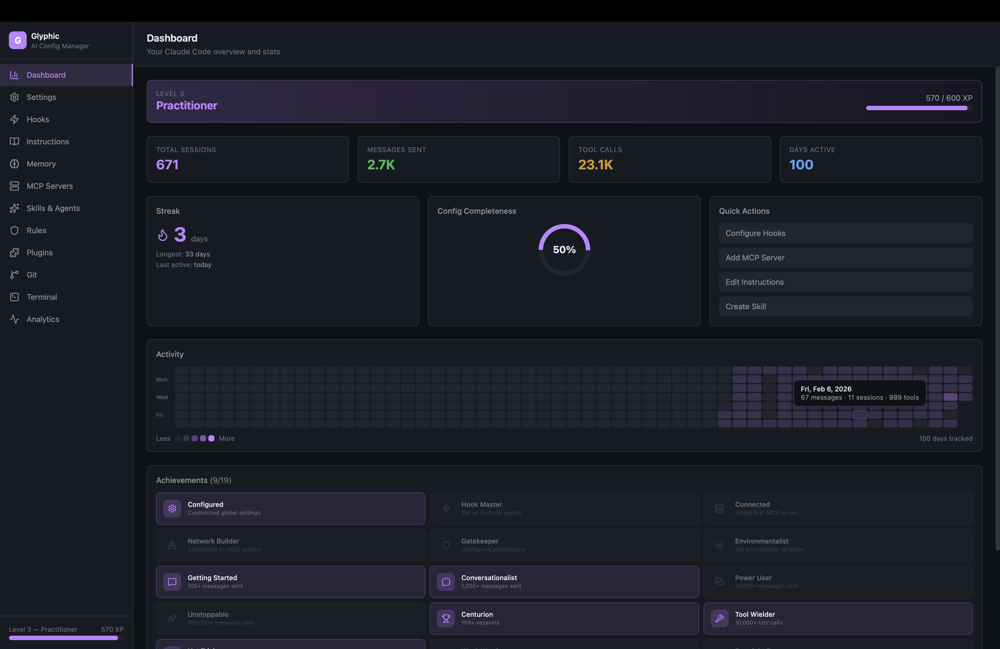
  <br><em>Dashboard — Live stats, XP levels, streaks, activity heatmap, achievements</em>
</p>

<details>
<summary>View all screenshots</summary>

<p align="center">
  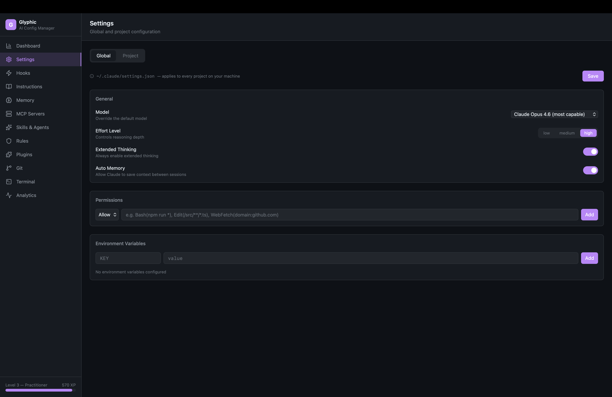
  <br><em>Settings — Global and project configuration with model selector</em>
</p>

<p align="center">
  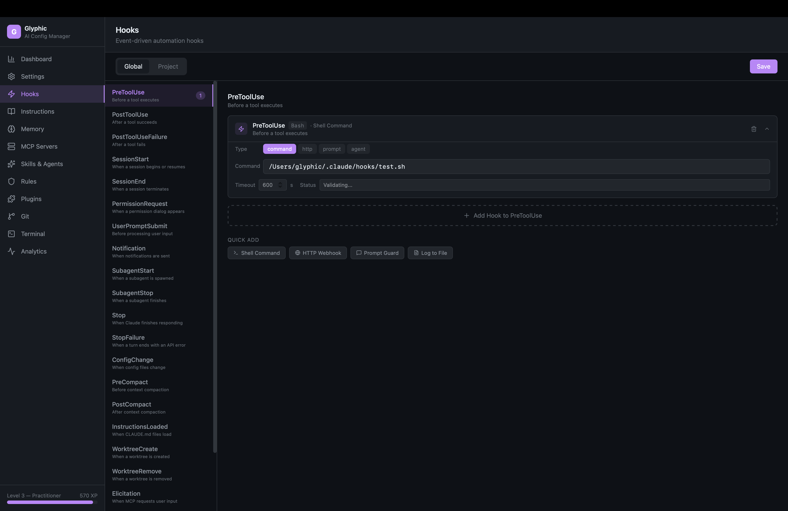
  <br><em>Hooks — Event sidebar with hook cards and quick-add templates</em>
</p>

<p align="center">
  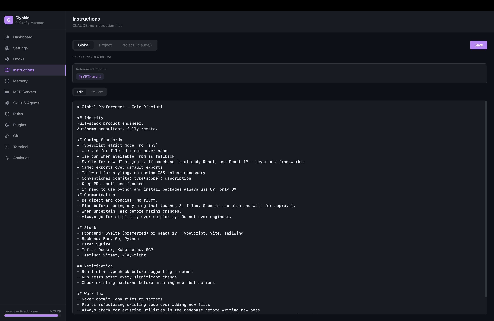
  <br><em>Instructions — CLAUDE.md editor with preview and clickable @imports</em>
</p>

<p align="center">
  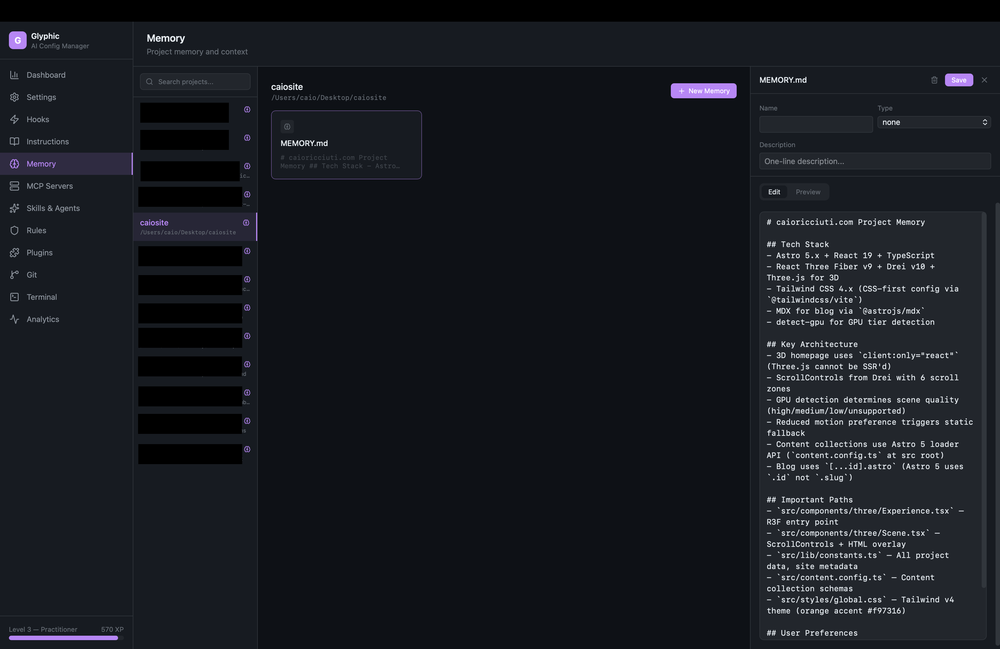
  <br><em>Memory — Project memory browser with card grid and editor</em>
</p>

<p align="center">
  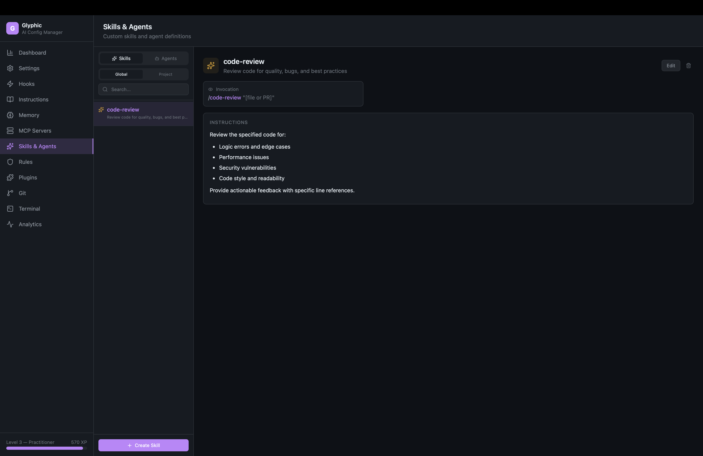
  <br><em>Skills & Agents — Detail view with config cards and connections</em>
</p>

<p align="center">
  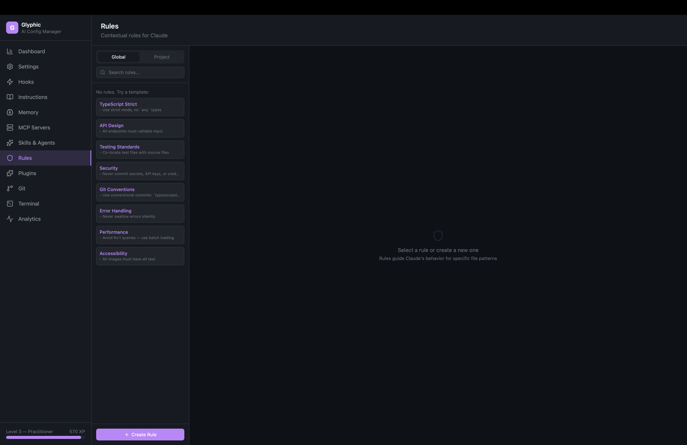
  <br><em>Rules — Contextual rules with path filters and templates</em>
</p>

<p align="center">
  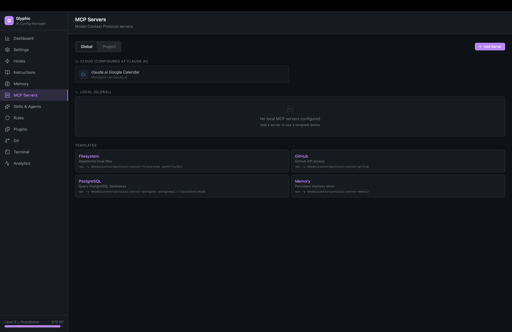
  <br><em>MCP Servers — Cloud and local MCP management with templates</em>
</p>

<p align="center">
  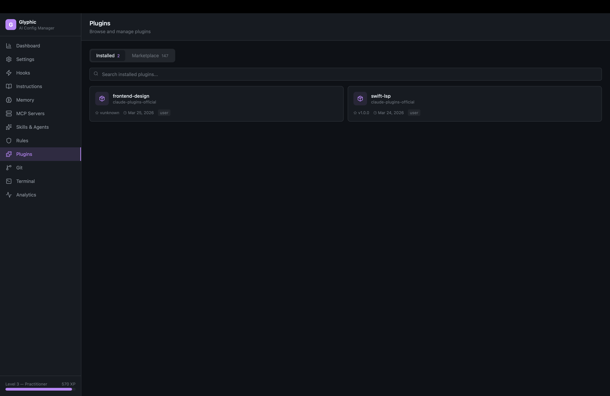
  <br><em>Plugins — Browse marketplace, install plugins, manage installed</em>
</p>

<p align="center">
  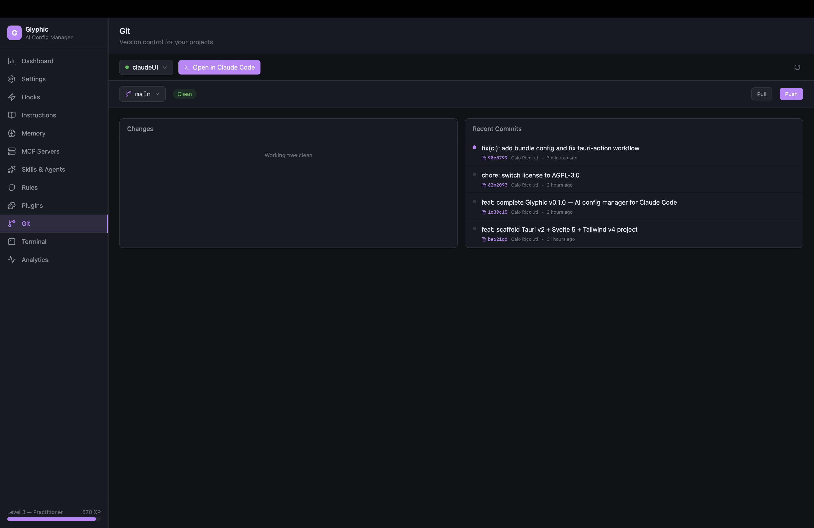
  <br><em>Git — Branch switcher, conventional commits, commit timeline</em>
</p>

<p align="center">
  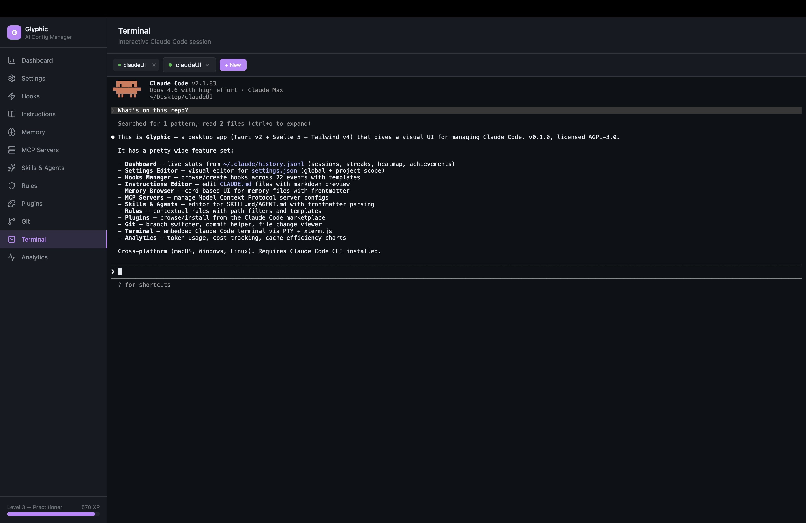
  <br><em>Terminal — Embedded Claude Code with persistent multi-tab sessions</em>
</p>

<p align="center">
  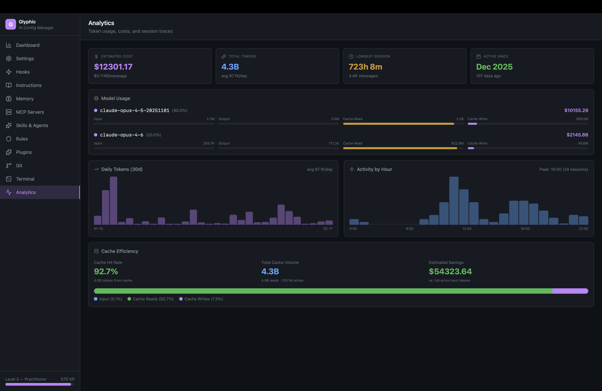
  <br><em>Analytics — Token costs, daily trends, hourly activity, cache efficiency</em>
</p>

</details>

## Features

### Dashboard
Live stats computed from your Claude Code history -- sessions, messages, streaks, activity heatmap, XP levels, and 19 achievements. All data is real, pulled directly from `~/.claude/history.jsonl`.

### Settings Editor
Visual editor for `settings.json` at global and project scope. Model selector, effort level, plan type (Max/Pro/API/Team/Free), toggle switches, permissions editor (allow/ask/deny rules), and environment variables. Project settings show shared (git-tracked) and local (gitignored) overrides side by side. Storage management with disk usage breakdown and one-click cleanup of safe-to-delete directories.

### Hooks Manager
Browse all 22 hook events in a sidebar, create hooks with a visual form or one-click templates (Shell Command, HTTP Webhook, Prompt Guard, Log to File). Each hook renders as a collapsible card with type selector, matcher, and configuration fields.

### Instructions Editor
Read and write `CLAUDE.md` files at global, project, and `.claude/` scopes. Edit/Preview toggle with proper dark-mode markdown rendering. Click `@import` references to open referenced files in a slide-in sheet.

### Memory Browser
Browse project memory files with a card-based UI. Each card shows type badge (user/feedback/project/reference), name, description, and content preview. Create new memory files with frontmatter editor.

### MCP Servers
Manage Model Context Protocol servers. See cloud-configured MCPs (from claude.ai) as read-only cards, add/edit/delete local MCPs with templates for Filesystem, GitHub, PostgreSQL, and Memory servers.

### Skills & Agents
Full-featured editor for SKILL.md and AGENT.md files. Detail view shows parsed frontmatter as visual cards (model, tools, permissions, memory, hooks, preloaded skills, inline MCP). Connection visualization shows relationships. 8 starter templates with proper frontmatter.

### Rules
Contextual rules with path-based filtering. Visual path filter badges, rendered markdown preview, 8 templates (TypeScript Strict, API Design, Testing, Security, Git Conventions, Error Handling, Performance, Accessibility).

### Plugins
Browse and install plugins from the Claude Code marketplace. See install counts, search across 100+ plugins, one-click install. Installed plugins show version, scope, and install date.

### Git
Branch switcher, grouped file changes (modified/added/deleted/untracked with colored icons), conventional commit helper (feat/fix/refactor dropdown), push and pull operations, commit timeline with hash copy. Auto-refreshes every 30 seconds.

### Terminal
Embedded Claude Code terminal via PTY + xterm.js. Sessions persist when navigating away. Multi-tab support for concurrent sessions across different projects. Full ANSI rendering -- colors, progress bars, everything Claude Code outputs works perfectly.

### Pipelines
Visual workflow builder powered by Svelte Flow. Drag-and-drop node canvas with zoom, pan, and minimap. 14 node types: Claude Prompt, Bash Command, GitHub Action, HTTP Request, Transform, Delay, Input, Output, Git, Filter, ReadFile, WriteFile, Notification, JSONExtract. Connect nodes to chain data flow -- use `{{input}}` or `{{NodeName}}` to reference outputs. Async execution with real-time status updates on the canvas. Pipeline scheduling with cron expressions and preset schedules, schedule logs and monitoring. Run history with replay. Save, load, and manage multiple pipelines.

### Session Replay
Browse and replay past Claude Code sessions step by step. Full-text search across all sessions. Tag sessions (bug-fix, feature, refactor). Export as Markdown. Live session detection with green pulse. Paginated loading for large sessions.

### Templates
Unified template gallery with 30+ pre-built configurations across skills, agents, rules, hooks, and MCP servers. Always accessible from every page. One-click to add.

### Analytics
Token usage and cost tracking per model with plan-aware labels (Max/Pro/API). Daily token trend and hourly activity charts with hover tooltips. Cache efficiency visualization. Cost monitoring widget in sidebar with budget alerts.

### Token Savings
Status dashboard for the token optimizer. Enable/disable optimization, view daily/weekly/monthly savings breakdowns with charts, discover optimization opportunities with actionable suggestions, and manage custom filter rules.

### Context Engine
Semantic search index for tool results and conversation turns. Enable/disable toggle, embedding coverage stats, one-click reindexing with progress tracking, database size monitoring, purge old entries, and browse recent indexed results.

### Command Palette
Press **Cmd+K** (or Ctrl+K) to open a fuzzy-search command palette. Jump to any page, toggle theme, or run actions instantly. Keyboard navigation with arrow keys and Enter. Page shortcuts via Cmd+1-9.

### Keybindings Editor
Visual editor for `~/.claude/keybindings.json`. View and customize all Claude Code keyboard shortcuts — key combos, commands, conditions. Reset to defaults with one click. Full chord support (e.g. Escape Escape).

### Other
- **System tray** — closing the window hides to tray instead of quitting; click the tray icon to restore; on macOS hides from Dock and Cmd+Tab when minimized
- **First-run onboarding** — guided setup for new users
- **CLAUDE.local.md** — personal project instructions (gitignored) via 4th Instructions tab
- **Light/Dark theme** toggle with persisted preference
- **Auto-updates** — notified of new versions, one-click update
- **Apple-signed** macOS builds — no Gatekeeper warnings
- **Cost monitoring** — sidebar widget with daily/monthly costs and budget alerts
- **Storage maintenance** — disk usage breakdown with one-click cleanup
- **About dialog** — version, author, links

## Installation

### Download

Go to [Releases](https://github.com/caioricciuti/glyphic/releases) and download the latest version for your platform:

- **macOS (Apple Silicon)**: `Glyphic_x.x.x_aarch64.dmg`
- **macOS (Intel)**: `Glyphic_x.x.x_x64.dmg`
- **Windows**: `.msi` installer or `.exe` setup
- **Linux**: `.deb` package, `.AppImage`, or `.rpm`

macOS builds are **signed and notarized** with an Apple Developer certificate. Just download, drag to Applications, and open.

The app includes **auto-updates** — you'll be notified when a new version is available and can update in one click.

### Prerequisites

- [Claude Code](https://docs.anthropic.com/en/docs/claude-code) must be installed and configured (`claude` CLI available in PATH)

## Development

### Requirements

- [Rust](https://rustup.rs/) (1.70+)
- [Bun](https://bun.sh/) (1.0+) or Node.js 18+
- [Tauri CLI](https://v2.tauri.app/start/prerequisites/)

### Setup

```bash
# Clone
git clone https://github.com/caioricciuti/glyphic.git
cd glyphic

# Install dependencies
bun install

# Run in development
bun run tauri dev

# Build for production
bun run tauri build
```

### Project Structure

```
glyphic/
├── src/                    # Svelte 5 frontend
│   ├── lib/
│   │   ├── components/     # 56 Svelte components (18 page modules)
│   │   ├── stores/         # Reactive stores (navigation, project context, terminal)
│   │   ├── tauri/          # Typed Tauri command wrappers
│   │   ├── types/          # TypeScript interfaces
│   │   └── utils/          # Streaks, achievements, formatting
│   └── app.css             # Tailwind v4 + dark theme + markdown styles
├── src-tauri/              # Rust backend
│   └── src/
│       ├── commands/       # 19 command modules (settings, hooks, git, pipelines, etc.)
│       ├── pty.rs          # PTY manager for embedded terminal
│       └── paths.rs        # Smart path resolution for project hashes
└── static/                 # App icons
```

### Tech Stack

| Layer | Technology |
|-------|-----------|
| Framework | [Tauri v2](https://v2.tauri.app/) |
| Frontend | [Svelte 5](https://svelte.dev/) (runes) |
| Styling | [Tailwind CSS v4](https://tailwindcss.com/) |
| Icons | [Lucide](https://lucide.dev/) |
| Terminal | [xterm.js](https://xtermjs.org/) + [portable-pty](https://docs.rs/portable-pty) |
| Markdown | [Marked](https://marked.js.org/) |
| Language | TypeScript (strict) + Rust |
| Package Manager | [Bun](https://bun.sh/) |

## How It Works

Glyphic reads and writes the same configuration files that Claude Code uses:

- `~/.claude/settings.json` -- global settings
- `~/.claude/CLAUDE.md` -- global instructions
- `~/.claude/history.jsonl` -- session history (read-only, for stats)
- `~/.claude/projects/` -- per-project memory and config
- `.claude/settings.json` -- project settings (shared)
- `.claude/settings.local.json` -- local overrides (gitignored)
- `.claude/skills/`, `.claude/agents/`, `.claude/rules/` -- custom extensions

No server, no account, no telemetry. Everything runs locally on your machine.

## Contributing

Contributions are welcome! Please read the [Contributing Guide](CONTRIBUTING.md) before submitting a PR.

- [Bug Reports](https://github.com/caioricciuti/glyphic/issues/new?template=bug_report.md)
- [Feature Requests](https://github.com/caioricciuti/glyphic/issues/new?template=feature_request.md)
- [Code of Conduct](CODE_OF_CONDUCT.md)
- [Security Policy](SECURITY.md)

## License

[AGPL-3.0](LICENSE)

## Credits

Built by [Caio Ricciuti](https://github.com/caioricciuti)
